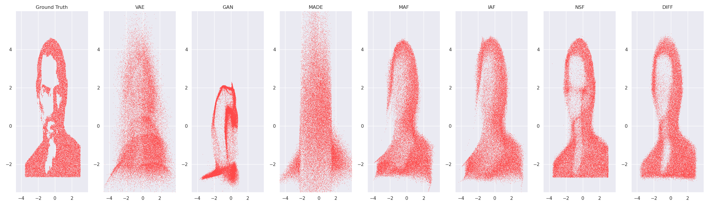

# Toy Collection of Generative Neural Networks

All models are tested and compared on 2D toy datasets. Currently this repo contains
implementations of the following models (PyTorch 1.13):
- Variational Autoencoders, Kingma et al., 2013
- Generative Adversarial Networks, Goodfellow et al., 2014
- Masked Autoencoder for Distribution Estimation, Germain et al., 2013
- Inverse Autoregressive Flows, Kingma et al., 2016
- Masked Autoregressive Flows, Papamakarios et al., 2017
- Neural Spline Flows, Durkan et al., 2019

